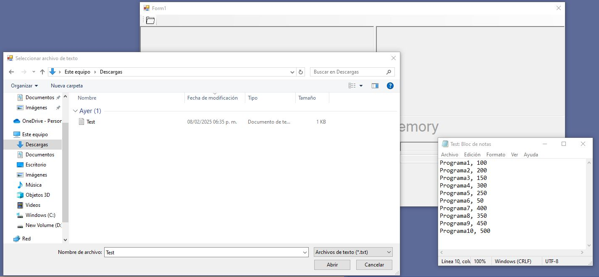
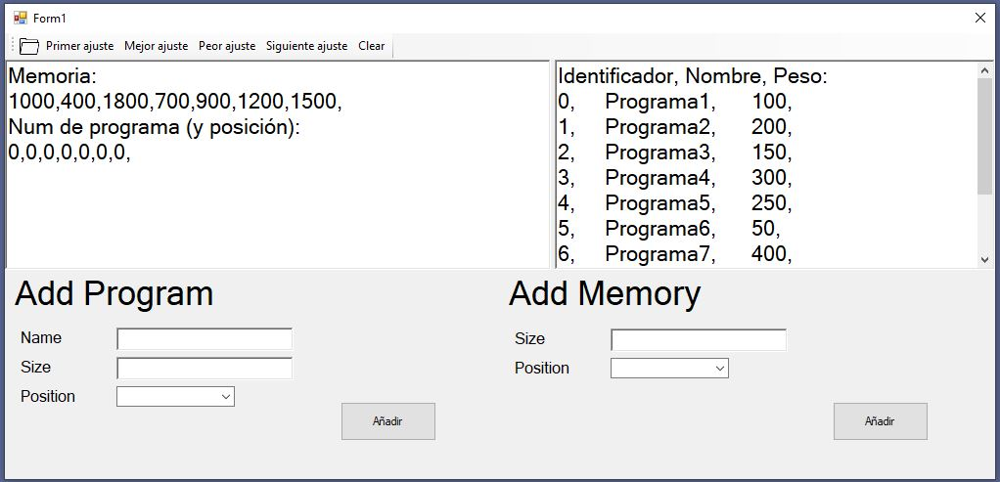

# Gestion-Memoria-Algoritmos

Este proyecto es una aplicación de Windows Forms que simula la gestión de memoria utilizando diferentes algoritmos de ajuste (primer ajuste, mejor ajuste, peor ajuste y siguiente ajuste).

## Requisitos

- .NET Framework 4.8
- Visual Studio 2019 o superior

## Estructura del Proyecto

- `Form1.cs`: Contiene la lógica principal de la aplicación.
- `Form1.Designer.cs`: Contiene el diseño de la interfaz de usuario.
- `Program.cs`: Punto de entrada principal para la aplicación.
- `App.config`: Configuración de la aplicación.
- `Properties/`: Contiene archivos de configuración y recursos del proyecto.

## Funcionalidades

1. **Cargar Archivo de Texto**: Permite cargar un archivo de texto con la información de los programas.
   

2. **Mostrar Memoria / Programas**: Muestra la lista de programas cargados en la aplicación.
   

3. **Añadir Programa**: Permite añadir un nuevo programa manualmente.
   

4. **Añadir Memoria**: Permite añadir un nuevo bloque de memoria manualmente.
   

5. **Algoritmos de Ajuste**:
   
   

   * Si el programa no se puede meter en alguna memoria se mostrara un mensaje de advertencia *

   * Primer Ajuste:

   

   * Mejor Ajuste

   

   * Peor Ajuste

   

   * Siguiente Ajuste

   

6. **Limpiar Memoria (Clear)**: Permite limpiar el estado actual de la memoria.

## Cómo Ejecutar

1. Clona el repositorio en tu máquina local.

   ```sh
   git clone https://github.com/Tiobilito/Gestion-Memoria-Algoritmos.git

   ```

2. Abre el proyecto en Visual Studio.

3. Restaura los paquetes NuGet necesarios.

4. Compila y ejecuta el proyecto.

## Contribuciones

Las contribuciones son bienvenidas. Por favor, abre un issue o un pull request para discutir cualquier cambio que desees realizar.

## Licencia

Este proyecto está licenciado bajo la Licencia MIT. Consulta el archivo LICENSE para más detalles.
